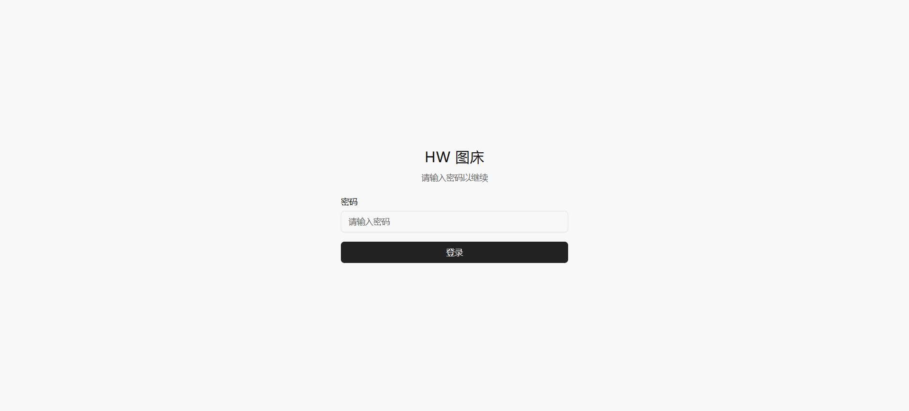
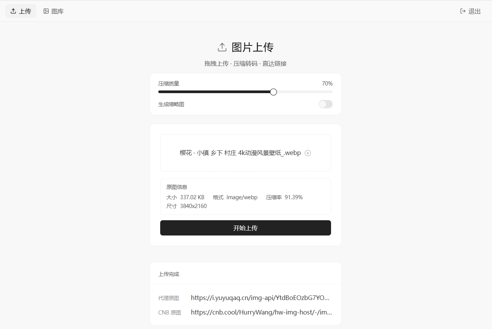
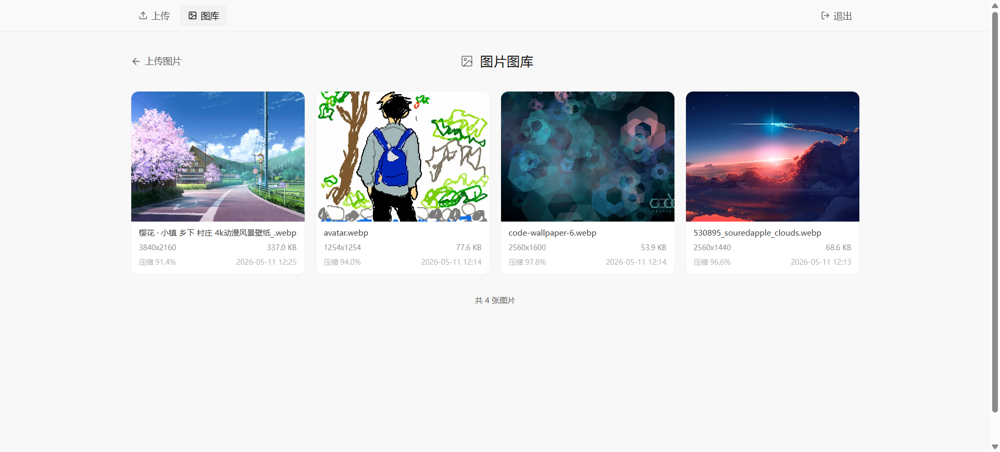

# hw-img-host

> [!TIP]
> 一些思路参考了[cnb](https://github.com/wujinpai/cnb)项目，在此表示感谢.

基于 **EdgeOne Pages Functions** + **CNB 对象存储** 的无服务器图片托管服务。支持拖拽上传、客户端 WebP 压缩、缩略图生成，并提供可调节的压缩质量和上传密码保护。





## 功能特性

- 拖拽或点击上传图片
- 客户端 WebP 压缩，滑块自由调节质量（10% ~ 100%）
- 可选生成缩略图，一键开关控制
- 上传密码保护（JWT 登录认证，7天过期）
- 上传进度实时显示
- 图片画廊浏览已上传图片
- 图片通过 EdgeOne 边缘函数代理，自带 CORS 跨域支持
- 基于 Vue 3 + shadcn-vue + TailwindCSS 构建

## 技术栈

| 层级     | 技术                                 |
| -------- | ------------------------------------ |
| 前端     | Vue 3 + TypeScript + Vite            |
| UI       | shadcn-vue + TailwindCSS v4 + lucide |
| 后端     | EdgeOne Pages Functions              |
| 图片处理 | 客户端 Canvas API (WebP 编码)        |
| 存储     | CNB 对象存储 (cnb.cool)              |
| 图片代理 | EdgeOne Edge Functions (边缘函数)    |

## 架构

```
Browser (Vue 3)
├── 登录 → POST /api/auth/login { password }
│   └── node-functions/api/[[default]].ts (Express)
│       ├── routes/auth.ts: 校验 UPLOAD_PASSWORD，返回 JWT (7天)
│       └── 前端 useAuth composable: 存 token 到 localStorage，axios 拦截器自动附加
├── 选择图片 → 客户端 Canvas WebP 压缩 → 可选缩略图生成
├── 获取上传签名 → GET /api/upload/sign?name=...&size=... (需 Bearer token)
│   └── routes/upload.ts: _auth.ts authMiddleware → CNB API → 返回签名 URL
├── PUT 签名 URL (直传 CNB 对象存储)
├── 或 服务端上传 → POST /api/upload/img (multipart/form-data, multer 20MB)
│   └── routes/upload.ts: 接收文件 → uploadToCnb() → CNB API → 返回代理链接
└── 展示代理图片链接

Image serving:
GET /img-api/* (eg. https://img.example.com/img-api/path/to/img.webp)
└── edge-functions/img-api/[[path]].ts (EdgeOne Edge Function)
    └── 代理到 CNB 对象存储 + CORS + 30s 缓存
```

## 快速开始

### 环境要求

- **Node.js**: `^20.19.0` 或 `>=22.12.0`
- **pnpm**: `11.0.9`（package.json 已锁定版本）
- **EdgeOne CLI**: `>=1.2.30`（本地全栈开发 + 部署，`npm i -g edgeone`）

### 方式一：AI Agent 自动部署（推荐）

本项目内置 Agent Skills，支持 AI 编程助手（ZCode / Cursor / Windsurf 等）一键部署到 EdgeOne Pages。

1. **Fork 本仓库**到你的 GitHub

2. **用 AI Agent 打开项目**，直接说：

   > 部署这个项目到 EdgeOne Pages

   Agent 会自动调用 `.agents/skills/edgeone-pages-deploy` skill：
   - 检查 EdgeOne CLI 版本
   - 引导登录（浏览器 / Token 两种方式）
   - 构建并部署，返回访问 URL

3. **配置环境变量**（部署后在 EdgeOne 控制台设置，见[环境配置](#环境配置)）

> 💡 Agent 也能帮你做本地开发：说"启动本地开发服务器"，它会调用 `edgeone-pages-dev` skill 启动全栈 dev（前端 + 函数 + KV）。
>
> Skills 位于 `.agents/skills/`，已通过 `skills-lock.json` 锁定版本，Fork 后即可使用。

### 方式二：手动安装

```sh
git clone https://github.com/Anyuluo996/hw-img-host.git
cd hw-img-host
pnpm install
```

#### 前端开发（纯 UI）

```sh
pnpm dev
```

访问 `http://localhost:5173`。此模式无后端，API 请求不可用。

#### 全栈开发（前端 + 函数 + KV）

```sh
# 首次：关联 EdgeOne 项目 + 拉取环境变量
PAGES_SOURCE=skills edgeone pages link
PAGES_SOURCE=skills edgeone pages env pull

# 启动全栈 dev server
PAGES_SOURCE=skills edgeone pages dev
```

访问 `http://localhost:8088`。所有 API 端点 + KV 均可用。

> ⚠️ 全栈 dev 会拉取线上环境变量到 `.env`（含真实密钥，已 gitignore）。

### 常用命令

| 命令 | 说明 |
| --- | --- |
| `pnpm dev` | Vite 前端开发服务器（`:5173`） |
| `pnpm build` | 类型检查 + 构建生产版本 |
| `pnpm type-check` | TypeScript 类型检查（`src/`） |
| `pnpm lint` | ESLint 检查并自动修复 |
| `pnpm format` | Prettier 格式化 `src/` |
| `pnpm test` | Vitest 单次测试 |
| `pnpm preview` | 本地预览生产构建 |
| `edgeone pages dev` | 全栈本地开发（`:8088`，含函数 + KV） |
| `edgeone pages deploy` | 手动部署到 EdgeOne Pages |

## 环境配置

在 EdgeOne 控制台中设置以下环境变量（不在 `.env` 文件中配置）：

| 变量 | 说明 | 示例 |
| --- | --- | --- |
| `BASE_IMG_URL` | 图床域名，**结尾必须带斜杠** | `https://img.example.com/` |
| `SLUG_IMG` | CNB 图床仓库名 | `your-username/your-repo` |
| `CNB_TOKEN` | **CNB 统一 token（推荐，全权限即可）** | `xxxx` |
| `TOKEN_IMG` | CNB token（imgs 读写）；可选，覆盖 `CNB_TOKEN` | `xxxx` |
| `TOKEN_FILE` | CNB token（files 读写，需 `repo-notes:rw`）；可选 | `xxxx` |
| `TOKEN_DELETE` | CNB token（删除文件，需 `repo-manage:rw`）；可选 | `xxxx` |
| `UPLOAD_PASSWORD` | 登录密码（未设置则登录接口不可用） | `your-secret-123` |
| `JWT_SECRET` | **JWT 签名密钥（强烈建议独立设置）**。与登录密码解耦，避免密码泄露即可伪造 token。`openssl rand -hex 32` | `a1b2...(64 字符)` |
| `KV_ALLOWED_ORIGINS` | kv-api 管理端点的 CORS 白名单（逗号分隔） | `https://img.example.com` |
| `ASSETS_KEYS` | Assets API 密钥 fallback（JSON）；也可在管理页面创建 | `{"koishi":"k_xxx"}` |

> **密码与密钥分离**：`UPLOAD_PASSWORD` 仅用于登录校验，`JWT_SECRET` 用于签发/验证 token。两者解耦后，即使登录密码泄露，攻击者也无法伪造 token；token 也无法反推密码。未配置 `JWT_SECRET` 时回退用 `UPLOAD_PASSWORD`（向后兼容，但建议尽快补配独立密钥）。
> **CORS 收紧**：`kv-api`（管理/写端点）默认只允许站点域名和 localhost 调用；公开读端点（`/img`、`/img-api`、`/file-api`）保持 `*` 开放，便于跨站引用图片。

## 获取 TOKEN_IMG

1. 登录 [CNB 官网](https://cnb.cool/)，点击右上角头像 → **个人设置**

   

2. 选择左侧 **访问令牌**，关联你的图床仓库（提前创建一个空仓库即可）

   

3. 授权范围选到最大（如有安全顾虑，请参考[官方文档](https://cnb.cool/docs)）

   

4. 点击 **生成 Token**，复制生成的令牌

   

## 项目结构

```
hw-img-host/
├── src/                           # 前端源码（Vue 3 SPA）
│   ├── views/                     # 页面：Home/Gallery/Tags/AssetsKeys/Login/Root
│   ├── components/                # FileUploader + shadcn-vue ui/
│   ├── composables/useAuth.ts     # JWT 认证 + axios 拦截器
│   └── router/                    # 路由（含秘密登录路径）
├── node-functions/api/            # Node Cloud Functions（Express 5）
│   ├── [[default]].ts             # 入口（assets 路由在 json() 之前挂载）
│   ├── routes/                    # auth/upload/delete/assets/assets-keys
│   ├── _utils.ts                  # CNB 上传/删除/签名工具
│   ├── _auth.ts                   # JWT 签发/验证
│   └── _validation.ts             # 文件名净化 + MAX_FILE_SIZE
├── edge-functions/                # Edge Functions（V8 运行时）
│   ├── assets-api/                # KV 索引 + 私有下载 + 密钥库
│   ├── assets-upload/             # PicGo 大文件 multipart（直接写 KV）
│   ├── upload-proxy/              # 大文件流式转发到 CNB
│   ├── img-api/ file-api/         # 图片/文件代理
│   ├── kv-api/                    # 图库索引（前端用）
│   └── img/                       # 随机图端点
├── tests/                         # Vitest + supertest
├── docs/                          # API.md / MECHANISM.md / DEVELOPMENT.md
├── scripts/                       # CLI 上传工具 + 油猴脚本
├── .agents/skills/                # AI Agent Skills（部署 + 开发）
└── package.json
```

## 上传流程

本服务支持多种上传方式，详见 [API.md 上传端点选择](./docs/API.md#上传端点选择)：

| 方式 | 端点 | 大小限制 | 适用场景 |
| --- | --- | --- | --- |
| 客户端直传 | `GET /api/upload/sign` → `PUT` | ≤ 20MB | 前端图库（压缩后直传 CNB） |
| 服务端上传 | `POST /api/upload/img` | ≤ 6MB | multipart 上传（含缩略图） |
| Assets API | `POST /api/assets` / `PUT` | ≤ 6MB | 程序化上传（外部服务） |
| 三阶段上传 | `sign → upload-proxy → complete` | **无限制** | 大文件（视频、归档包） |
| PicGo 大文件 | `POST /assets-upload` | **无限制** | PicGo/PicList 图床客户端 |

> ⚠️ Node Function 请求体上限 ~6MB（EdgeOne 平台限制），超限会 500 崩溃。
> 大文件必须用三阶段上传或 `/assets-upload`，详见 [开发指南 - 平台边界](./docs/DEVELOPMENT.md#平台边界与限制)。

## 贡献

欢迎提交 Issue 或 Pull Request。

## 更多文档

| 文档 | 内容 |
| --- | --- |
| [docs/API.md](./docs/API.md) | HTTP API 完整参考（Assets 中转 API、图床管理 API、公开访问端点、错误码） |
| [docs/MECHANISM.md](./docs/MECHANISM.md) | 机制原理（三阶段上传、孤儿自愈、TTL 懒删除、乐观并发、EdgeOne 平台约束） |
| [docs/DEVELOPMENT.md](./docs/DEVELOPMENT.md) | 开发指南（环境搭建、本地开发、代码规范、平台边界、调试技巧、部署、测试） |
| [docs/CNB.md](./docs/CNB.md) | CNB 对象存储开发参考（三域名分工、Token 权限、上传/删除/访问、imgs vs files、已知怪癖） |
| [AGENTS.md](./AGENTS.md) | Agent 开发指南（包管理器、命令、架构、代码约定） |

<!-- build trigger 1782514178 -->
